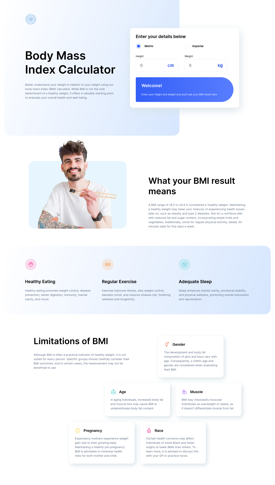
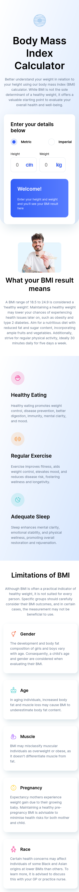

# Frontend Mentor - Password generator app solution

This is a solution to the [Body Mass Index Calculator challenge on Frontend Mentor](https://www.frontendmentor.io/challenges/body-mass-index-calculator-brrBkfSz1T)

## Table of contents

- [Overview](#overview)
  - [The challenge](#the-challenge)
  - [Screenshot](#screenshot)
  - [Links](#links)
- [Author](#author)

## Overview

### The challenge

Users should be able to:

- Select whether they want to use metric or imperial units
- Enter their height and weight
- See their BMI result, with their weight classification and healthy weight range
- View the optimal layout for the interface depending on their device's screen size
- See hover and focus states for all interactive elements on the page

### Screenshot

- Desktop Preview \
  

- Mobile Preview \
  

### Links

- Solution URL: [solution](https://github.com/Biggboss7/BMI_Calculator)
- Live Site URL: [live site](https://bmi-calculator-bigboss.netlify.app/)

## Author

- Github - (https://github.com/Biggboss7/)
